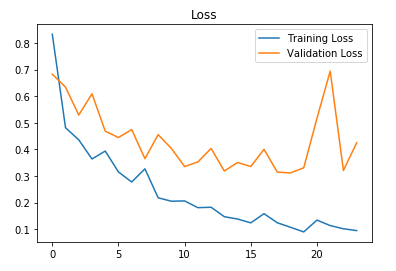

# Brain MRI Tumor Classification Using Convolutional Neural Networks

This project focuses on creating a detection model utilizing convolutional neural networks (CNN) in TensorFlow and Keras. The brain MRI image dataset used for this project was sourced from Kaggle and can be accessed [here](https://www.kaggle.com/navoneel/brain-mri-images-for-brain-tumor-detection).

## Data Overview
The dataset comprises two folders: `yes` and `no`, containing a total of 253 brain MRI images. The `yes` folder has 155 images of tumorous brains, while the `no` folder has 98 images of non-tumorous brains.

## Getting Started

**Note:** If GitHub's IPython notebook viewer is not rendering the notebooks properly, you can view them using [nbviewer](https://nbviewer.jupyter.org/).

## Data Augmentation

### Why Use Data Augmentation?
Given the small size of the dataset, data augmentation was crucial for generating a sufficient number of examples to train the neural network and for addressing data imbalance issues.

- **Original dataset:** 155 positive and 98 negative examples (253 total images).
- **Augmented dataset:** 1085 positive and 980 negative examples (2065 total images).

*Note: The augmented dataset includes the original 253 images, located in the `augmented data` folder.*

## Data Preprocessing

Each image underwent the following preprocessing steps:
1. Cropping to retain only the brain region.
2. Resizing to (240, 240, 3) to standardize the input size for the neural network.
3. Normalizing pixel values to the range 0-1.

## Data Split

The dataset was divided as follows:
- 70% for training
- 15% for validation
- 15% for testing

## Neural Network Architecture

The model architecture is as follows:
1. Zero Padding layer with a pool size of (2, 2).
2. Convolutional layer with 32 filters, a filter size of (7, 7), and a stride of 1.
3. Batch Normalization layer to speed up computation.
4. ReLU activation layer.
5. Two Max Pooling layers with filter size (4, 4) and stride (4, 4).
6. Flattening layer to convert the 3D matrix into a 1D vector.
7. Dense layer with one neuron and sigmoid activation for binary classification.


### Rationale for Architecture
Initial experiments with transfer learning using ResNet50 and VGG-16 resulted in overfitting due to the small dataset size. Given computational and memory constraints (6th generation Intel i7 CPU, 8 GB memory), a simpler architecture was adopted and trained from scratch, yielding effective results.

## Model Training

The model was trained over 24 epochs. Below are the plots for loss and accuracy:




The highest validation accuracy was achieved at epoch 23.

## Results

The final model achieved the following performance metrics:
- **Accuracy on test set:** 88.7%
- **F1 score on test set:** 0.88

### Performance Summary

|              | Validation set | Test set  |
|--------------|----------------|-----------|
| **Accuracy** | 91%            | 89%       |
| **F1 score** | 0.91           | 0.88      |

## Final Notes

### Contents of the Repository:
1. Code in IPython notebooks.
2. Model weights, with the best model saved as `cnn-parameters-improvement-23-0.91.model`.
3. Models stored as `.model` files, which can be loaded using:
    ```python
    from tensorflow.keras.models import load_model
    best_model = load_model(filepath='models/cnn-parameters-improvement-23-0.91.model')
    ```
4. Original data in `yes` and `no` folders, and augmented data in `augmented data` folder.

Contributions are welcome! Thank you for checking out this project.
